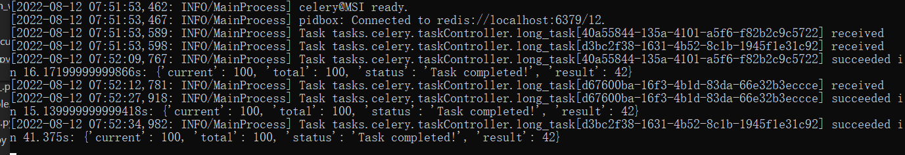

##### Flask Restful Application

一个基于Flask的restful逻辑框架的分享。

---
### 程序配置
```
// config/__init__.py 

class Environment(enum.Enum):
    # 环境
    DEVELOPMENT = 0     # 开发
    TESTING = 1         # 测试
    ONLINE = 2          # 生产

// celery configuration
class CeleryConfig(BaseConfigure):

// SQLALchemy configuration
class APP_SETTINGS(BaseConfigure)

// flask configuration
class API_SETTING(BaseConfigure):

```


---
### 运行方法


```shell
> mkdir .env
> cd .env
> python -m venv web 
> ./env/web/Script/activete 

> pip3 install -r requirements.txt
> python migrate db init 
> python migrate db migrate 
> python migrate db update
> python main.py
```


```


│─config                    // 配置
├─core                      // 核心代码区域
├─define                    // 配置与文档
│  ├─document               // 文档
├─interface                 // 接口与逻辑
│  ├─params                 // 参数
│  ├─resource               // 接口
├─log                       // 日志
├─migrations                
│  ├─versions
├─orm                       // ORM
│  ├─model                  // 模板
├─tasks                     // 任务工作区celery
└─utils                     // 实用工具

// 暂定这些目录，后面还会陆续追加

```
##### API Document
> example /define/document/document.py

```python
class _params:

    dt = DocumentFormat

    def login(self, api):
        token = self.dt(_name="token", _type=str,
                        _required=True, _location="query",
                        _value="", _description="登录后的token信息")
        access_token = self.dt(_name="access_token", _type=str,
                               _required=True, _location="query",
                               _value="", _description="接入的token信息")
        _login_result = self.dt(_value=[token, access_token],
                                parse=api.parser()).params()
        return api.doc(parser=_login_result)


class _body:

    dt = DocumentFormat

    def login(self, api):
        _account = self.dt(_type=str, _value="user01",
                           _description="账户", _value_ext=dict(
                               min_length=7, max_length=15
                           ))
        _password = self.dt(_type=str, _value="user01",
                            _description="密码", _value_ext=dict(
                                min_length=7, max_length=15
                            ))
        _renew = self.dt(
            _type=dict,
            _value={
                "account": _account,
                "password": _password
            },
            _name="user_account_number_01",
        )
        return api.doc(body=_renew.json(api))

```
> 
> 装饰 example /interface/resource/login.py


```python

from define.document import params, body
class LGResource(Resource)
    @params.login(api)
    def get(self, response):
        pass
    
    @body.login(api)
    def post(self, response):
        pass 

```

* API示例图片


---

### 业务流程


--- 
### 编写任务
```python
# /celery/taskController.py 
# 这里的long_task是根据官方的例子写的。 
# 后续可以结合一些websocket进行使用

def collect(celery):
    class Controller(object):
        """任务类

        """
        @celery.task(bind=True)
        def long_task(self):
            """Background task that runs a long function with progress reports."""
            verb = ['Starting up', 'Booting',
                    'Repairing', 'Loading', 'Checking']
            adjective = ['master', 'radiant', 'silent', 'harmonic', 'fast']
            noun = ['solar array', 'particle reshaper',
                    'cosmic ray', 'orbiter', 'bit']
            message = ''
            total = random.randint(10, 50)
            for i in range(total):
                if not message or random.random() < 0.25:
                    message = '{0} {1} {2}...'.format(random.choice(verb),
                                                      random.choice(
                        adjective),
                        random.choice(noun))
                self.update_state(state='PROGRESS',
                                  meta={'current': i, 'total': total,
                                        'status': message})
                time.sleep(1)
            return {'current': 100, 'total': 100, 'status': 'Task completed!',
                    'result': 42}

    return Controller
# /interface/main.py 
@app.route('/', methods=['GET', "POST"])
def hello_world():
    celery_id = celery._common_task_list.collect.long_task.apply_async()
    return "<a href={}>查看执行状态!<h1>".format('/status/' + str(celery_id))

@app.route('/status/<task_id>')
def taskstatus(task_id):
    task = celery._common_task_list.collect.long_task.AsyncResult(
        task_id)
    if task.state == 'PENDING':
        response = {
            'state': task.state,
            'current': 0,
            'total': 1,
            'status': 'Pending...'
        }
    elif task.state != 'FAILURE':
        response = {
            'state': task.state,
            'current': task.info.get('current', 0),
            'total': task.info.get('total', 1),
            'status': task.info.get('status', '')
        }
        if 'result' in task.info:
            response['result'] = task.info['result']
    else:
        response = {
            'state': task.state,
            'current': 1,
            'total': 1,
            'status': str(task.info),
        }
    return jsonify(response)

```
> celery -A interface.main.celery worker -l info -P eventlet


