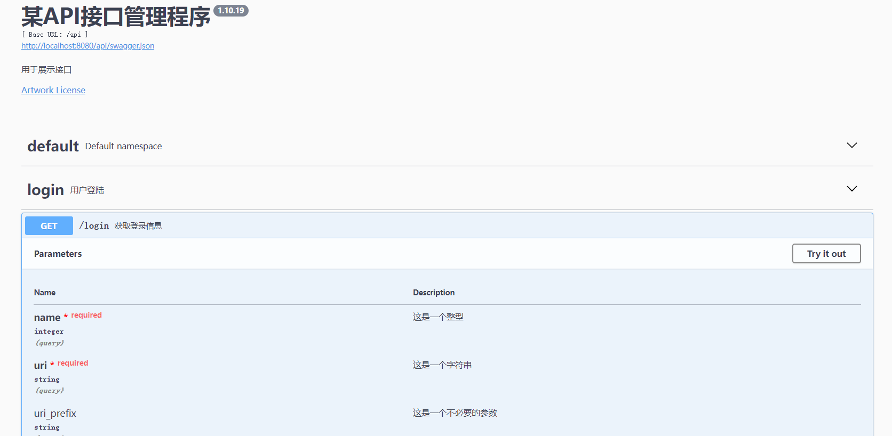
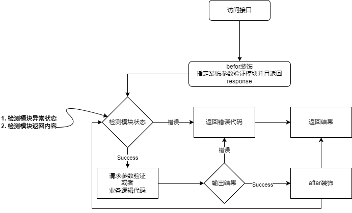

##### Flask Restful Application

想做一个基于Flask的微服务整套逻辑框架的分享。

---

* 运行方法


```shell
> mkdir .env
> cd .env
> python -m venv web 
> ./env/web/Script/activete 

> pip3 install -r requirements.txt
> python migrate db init 
> python migrate db migrate 
> python migrate db update
> python main.py
```


```


│─config                    // 配置
├─core                      // 核心代码区域
├─define                    // 配置与文档
│  ├─document               // 文档
├─interface                 // 接口与逻辑
│  ├─params                 // 参数
│  ├─resource               // 接口
├─log                       // 日志
├─migrations                
│  ├─versions
├─orm                       // ORM
│  ├─model                  // 模板
├─tasks                     // 任务工作区celery
└─utils                     // 实用工具

// 暂定这些目录，后面还会陆续追加

```
##### API Document
> example /define/document/document.py

```python
class _params:

    dt = DocumentFormat

    def login(self, api):
        token = self.dt(_name="token", _type=str,
                        _required=True, _location="query",
                        _value="", _description="登录后的token信息")
        access_token = self.dt(_name="access_token", _type=str,
                               _required=True, _location="query",
                               _value="", _description="接入的token信息")
        _login_result = self.dt(_value=[token, access_token],
                                parse=api.parser()).params()
        return api.doc(parser=_login_result)


class _body:

    dt = DocumentFormat

    def login(self, api):
        _account = self.dt(_type=str, _value="user01",
                           _description="账户", _value_ext=dict(
                               min_length=7, max_length=15
                           ))
        _password = self.dt(_type=str, _value="user01",
                            _description="密码", _value_ext=dict(
                                min_length=7, max_length=15
                            ))
        _renew = self.dt(
            _type=dict,
            _value={
                "account": _account,
                "password": _password
            },
            _name="user_account_number_01",
        )
        return api.doc(body=_renew.json(api))

```
> 
> 装饰 example /interface/resource/login.py


```python

from define.document import params, body
class LGResource(Resource)
    @params.login(api)
    def get(self, response):
        pass
    
    @body.login(api)
    def post(self, response):
        pass 

```

* API示例图片



* 业务流程



